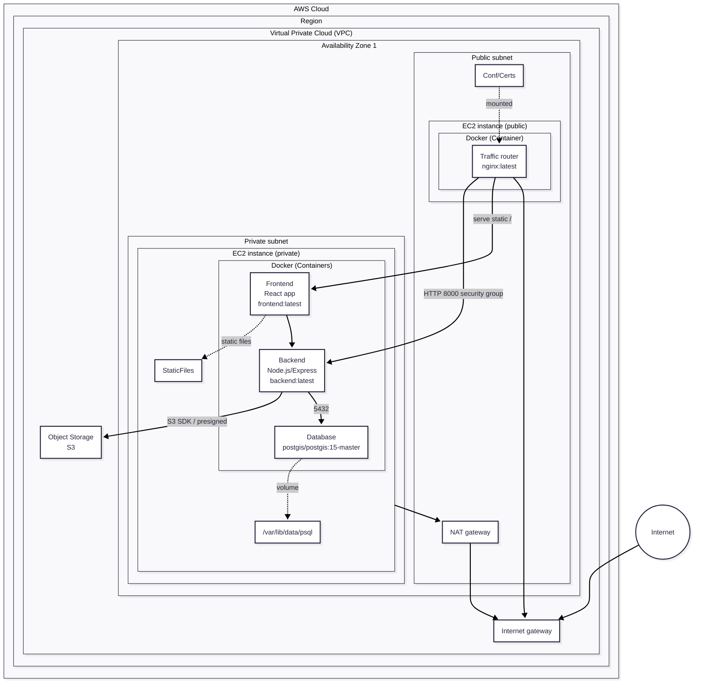

# Arquitectura de despliegue

A nivel de red, la VPC establece el perímetro con Internet Gateway en el borde y NAT Gateway para salida controlada desde la subred privada.

En la subred pública:
- Una EC2 con nginx expone 443/HTTPS.
- Monta Conf/Certs (cadena TLS, clave y config).
- Oficia de reverse proxy: rutea las solicitudes a la API interna por HTTP 8000 según security groups que limitan origen y puerto (ingress 443 abierto hacia Internet; egress desde nginx únicamente al SG del backend en 8000).
- Publica el build del frontend en “/”, descargando al backend de servir estáticos.

En la subred privada corre una EC2 con Docker que orquesta tres contenedores:
- **Backend** (Node.js/Express, backend:latest): implementa la lógica de negocio y el acceso a datos, mantiene conexiones con PostgreSQL/PostGIS por TCP 5432 y genera presigned URLs para S3, permitiendo upload/download directo desde el navegador sin exponer credenciales ni forzar a la API a transportar binarios.
- **Base de datos** (postgis/postgis:15-master): opera con tipos e índices geoespaciales (p.ej., geography/geometry + GiST) para consultas por proximidad y persiste en /var/lib/postgresql/data mediante un volumen de Docker, evitando pérdida de datos ante redeploy.
- **Frontend** (frontend:latest): se limita a producir artefactos estáticos listos para CDN o para el propio nginx del borde.

Este recorte entre borde, cómputo y datos mantiene superficies limpias y reglas simples de circulación:
- Nada de servicios de negocio de cara a Internet fuera de nginx.
- Puertos internos mínimos y explícitos.

**Flujo de operación:**
- El cliente entra por IGW → nginx (443).
- Nginx valida y reenvía la solicitud al backend (8000, privado).
- La API procesa operaciones transaccionales y geoespaciales contra Postgres (5432).
- Cuando hay intercambio de archivos, la API solicita a S3 una URL prefirmada con vencimiento y restricciones de método/tipo de contenido.
- El navegador usa esa URL para subir/bajar directamente al bucket, mientras la API guarda solo los metadatos necesarios.

La subred privada no es alcanzable desde Internet; el mantenimiento se realiza por túneles (p.ej., SSM Session Manager), sin abrir 8000 ni 5432 al exterior.

El esquema aplica menor privilegio (único servicio público: nginx), reduce acoples entre camino transaccional y manejo de binarios, y queda listo para escalar horizontalmente (réplicas del backend detrás del mismo proxy y/o externalización definitiva de estáticos vía S3/CloudFront) sin tocar el modelo de seguridad ni la semántica de puertos.

1. **Entrada del cliente:** El cliente accede a través del Internet Gateway (IGW) y llega al servidor nginx expuesto en el puerto 443 (HTTPS).
2. **Ruteo y validación:** nginx valida la solicitud y la reenvía al backend ubicado en la subred privada, comunicándose por el puerto 8000.
3. **Procesamiento de la API:** La API (Node.js/Express) procesa operaciones transaccionales y geoespaciales, interactuando con la base de datos Postgres (puerto 5432).
4. **Intercambio de archivos:** Cuando se requiere subir o descargar archivos, la API solicita a S3 una URL prefirmada con vencimiento y restricciones de método/tipo de contenido.
5. **Acceso directo a S3:** El navegador utiliza la URL prefirmada para subir o bajar archivos directamente al bucket de S3, mientras la API almacena únicamente los metadatos necesarios.
6. **Seguridad y mantenimiento:** La subred privada no es accesible desde Internet; el mantenimiento se realiza mediante túneles seguros (por ejemplo, SSM Session Manager), sin exponer los puertos 8000 ni 5432 al exterior.
7. **Principio de menor privilegio y escalabilidad:** Solo nginx está expuesto públicamente, lo que reduce acoples entre el flujo transaccional y el manejo de binarios. El sistema está preparado para escalar horizontalmente (réplicas del backend detrás del mismo proxy y/o externalización de estáticos vía S3/CloudFront) sin modificar el modelo de seguridad ni la semántica de puertos.
