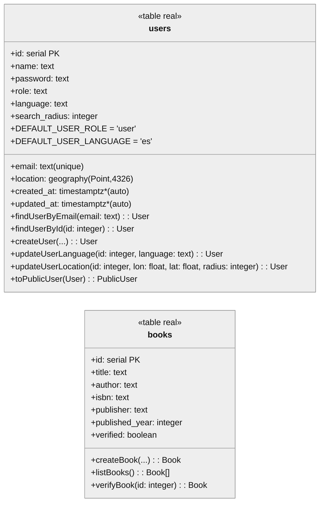

# Esquema de base de datos

> Última revisión: 2025-10-08

## Estado actual

El backend en producción local expone solo dos tablas gestionadas por las migraciones del
repositorio. La siguiente vista en Mermaid refleja fielmente la estructura creada por los
scripts `001`–`005`:

\*Las columnas `created_at` y `updated_at` provienen de valores por defecto de PostgreSQL si se
configuran `DEFAULT now()` en futuras migraciones; hoy no están definidas explícitamente.

### Campos derivados en el repositorio

- `users.location` se expone como `{ latitude, longitude } | null` usando
  `ST_X`/`ST_Y`. El repositorio traduce los nombres de columna a `camelCase` para el
  dominio (`search_radius` → `searchRadius`).
- `books.published_year` se traduce a `publishedYear` y los campos opcionales (`author`,
  `isbn`, `publisher`) se exponen como `string | null` según el esquema real.

## Brecha frente al frontend

El frontend ya maneja flujos avanzados de publicaciones, entrega, imágenes y listados por
usuario que hoy no tienen soporte en el backend ni en la base de datos. Las principales
faltantes son:

1. **Publicaciones y borradores por usuario**: falta una tabla intermedia
   (`publications`) que vincule `users` con `books`, estados (`draft`, `published`),
   condiciones, canales de entrega y disponibilidad (`public`/`private`).
2. **Imágenes adjuntas**: el frontend maneja portadas y subidas múltiples. No existe un
   almacenamiento (`book_images` o similar) ni rutas para subir/gestionar archivos.
3. **Estadísticas comunitarias** (`/community/*`): no hay tablas de actividad ni de
   agregados (`publication_stats`, `community_events`).
4. **Formulario de contacto** (`/contact/submit`): no existe tabla `contact_messages` ni
   endpoints REST.
5. **Consultas personales** (`/books/mine`): se requiere filtrar por usuario autenticado y
   respetar visibilidad/estado.

## TODOs técnicos

- TODO(db-alignment): diseñar y migrar tablas `publications`, `publication_images`,
  `publication_stats` y relaciones necesarias para reflejar el flujo completo del frontend.
- TODO(api-sync): documentar contratos esperados por el frontend (payload de publicación,
  filtros de búsqueda, paginación) y alinear las rutas REST antes de deshabilitar los mocks
  de MSW.
- TODO(storage): definir estrategia para almacenar imágenes (S3, buckets locales) y registrar
  metadatos referenciales en la base de datos.
- TODO(contact): crear modelo y API para solicitudes de contacto, incluyendo limitación de
  frecuencia y trazabilidad para soporte comunitario.

## Próximos pasos recomendados

1. **Definir el modelo conceptual** a partir de `PublishBookPayload` y los mocks de
   `RELATIVE_API_ROUTES.BOOKS`. Traducirlo en migraciones incrementales.
2. **Actualizar los repositorios y servicios** del backend (books/publications) con métodos
   orientados a usuario (`listUserBooks`, `saveDraft`, `publish`, etc.).
3. **Configurar pruebas end-to-end** que verifiquen la coherencia entre frontend y backend
   una vez disponibles los endpoints reales.

Esta guía se mantendrá actualizada a medida que avancemos con las migraciones y servicios
faltantes.
