# Esquema de base de datos

## Diagrama de clases (Mermaid)

> El diagrama representa el **modelo físico**: cada “clase” es una **tabla real** y cada atributo es una **columna real**. Incluye cardinalidades, composiciones, tablas puente para M:N y los métodos principales que implementa la aplicación alrededor de cada entidad.

```mermaid
---
config:
  theme: redux
  look: classic
  layout: elk
---
classDiagram
    direction RL

    class users {
        <<table>>
        +id: serial PK
        +name: text
        +password_hash: text
        +role: text
        +language: text
        +bio: text
        +search_radius: integer
        +created_at: timestamptz
        +updated_at: timestamptz
        +email: text(unique)
        +location: geography(Point,4326)
        +findUserByEmail(email: text): User
        +findUserById(id: integer): User
        +createUser(name: text, email: text, password: text): User
        +updateUserLanguage(id: integer, language: text): User
        +updateUserLocation(id: integer, lon: float, lat: float, radius: integer): User
        +toPublicUser(User): PublicUser
    }

    class books {
        <<table>>
        +id: serial PK
        +title: text
        +isbn: text
        +authors: text
        +publisher: text
        +published_year: integer
        +description: text
        +verified: boolean
        +created_at: timestamptz
        +createBook(title: text, author: text, isbn: text, publisher: text, publishedYear: integer): Book
        +listBooks(): Book[]
        +verifyBook(id: integer): Book
    }

    class book_images {
        <<table>>
        +id: serial PK
        +book_id: integer FK -> books.id
        +url: text
        +is_primary: boolean
        +metadata: jsonb
        +created_at: timestamptz
        +addBookImage(bookId: integer, url: text, isPrimary: boolean): BookImage
        +setPrimaryBookImage(bookId: integer, imageId: integer): void
        +listBookImages(bookId: integer): BookImage[]
        +deleteBookImage(id: integer): void
    }

    class publications {
        <<table>>
        +id: serial PK
        +user_id: integer FK -> users.id
        +book_id: integer FK -> books.id
        +status: publication_status
        +type: publication_type
        +description: text
        +condition: text
        +created_at: timestamptz
        +updated_at: timestamptz
        +verified_at: timestamptz
        +verified_by: integer FK -> users.id
        +location: geography(Point,4326)
        +createPublication(userId: integer, bookId: integer, type: publication_type, description: text, condition: text, location: geography?): Publication
        +listPublications(filters): Publication[]
        +updatePublicationStatus(id: integer, status: publication_status): Publication
        +updatePublicationDetails(id: integer, description: text, condition: text, location: geography?): Publication
    }

    class publication_stats {
        <<table>>
        +publication_id: integer PK/FK -> publications.id
        +views: integer
        +likes: integer
        +messages_count: integer
        +swaps_completed: integer
        +updated_at: timestamptz
        +incrementViews(publicationId: integer): void
        +incrementLikes(publicationId: integer): void
        +incrementMessages(publicationId: integer): void
        +incrementSwapsCompleted(publicationId: integer): void
        +getStats(publicationId: integer): publication_stats
    }

    class publication_images {
        <<table>>
        +id: serial PK
        +publication_id: integer FK -> publications.id
        +url: text
        +is_primary: boolean
        +metadata: jsonb
        +created_at: timestamptz
        +addPublicationImage(pubId: integer, url: text, isPrimary: boolean): PublicationImage
        +setPrimaryPublicationImage(pubId: integer, imageId: integer): void
        +listPublicationImages(pubId: integer): PublicationImage[]
        +deletePublicationImage(id: integer): void
    }

    class conversations {
        <<table>>
        +id: serial PK
        +created_at: timestamptz
        +status: conversation_status
        +last_message_at: timestamptz
        +publication_id: integer FK -> publications.id(nullable)
        +createConversation(user1Id: integer, user2Id: integer, publicationId: integer?): Conversation
        +listUserConversations(userId: integer): Conversation[]
        +closeConversation(id: integer): void
        +archiveConversation(id: integer): void
    }

    class messages {
        <<table>>
        +id: serial PK
        +conversation_id: integer FK -> conversations.id
        +sender_id: integer FK -> users.id
        +recipient_id: integer FK -> users.id
        +content: text
        +created_at: timestamptz
        +read_at: timestamptz
        +sendMessage(conversationId: integer, senderId: integer, content: text): Message
        +getConversationMessages(conversationId: integer): Message[]
        +markMessageAsRead(messageId: integer): void
    }

    class book_corners {
        <<table>>
        +id: serial PK
        +name: text
        +owner_user_id: integer FK -> users.id
        +description: text
        +created_at: timestamptz
        +location: geography(Point,4326)
        +createBookCorner(ownerId: integer, name: text, location: geography, description: text): BookCorner
        +listBookCornersNear(lat: float, lon: float, radius: integer): BookCorner[]
        +approveBookCorner(id: integer): void
    }

    class genres {
        <<table>>
        +id: serial PK
        +name: text
        +listGenres(): Genre[]
    }

    class user_genres {
        <<table>>
        +user_id: integer FK -> users.id
        +genre_id: integer FK -> genres.id
        +addUserGenre(userId: integer, genreId: integer): void
        +removeUserGenre(userId: integer, genreId: integer): void
        +listUserGenres(userId: integer): Genre[]
    }

    class book_suggestions {
        <<table>>
        +id: serial PK
        +user_id: integer FK -> users.id
        +title: text
        +authors: text
        +isbn: text
        +status: book_suggestion_status
        +created_at: timestamptz
        +createBookSuggestion(userId: integer, title: text, authors: text, isbn: text): BookSuggestion
        +listBookSuggestions(status: book_suggestion_status): BookSuggestion[]
        +approveBookSuggestion(id: integer): void
        +rejectBookSuggestion(id: integer): void
    }

    class publication_status {
        <<enumeration>>
        draft
        pending
        verified
        rejected
    }

    class publication_type {
        <<enumeration>>
        offer
        request
        exchange
    }

    class conversation_status {
        <<enumeration>>
        open
        closed
        archived
    }

    class book_suggestion_status {
        <<enumeration>>
        pending
        approved
        rejected
    }

    users "1" --> "0..*" publications : creates
    publications "*" --> "1" books : refers_to
    publications "1" *-- "1" publication_stats : has_stats
    books "1" *-- "0..*" book_images : has_covers
    publications "1" *-- "0..*" publication_images : has_photos
    users "1" --> "0..*" book_corners : owns
    publications "0..1" --> "0..*" conversations : discussed_in
    conversations "1" *-- "0..*" messages : contains
    messages "*" --> "1" users : sender
    messages "*" --> "1" users : recipient
    users "1" --> "0..*" user_genres : prefers
    genres "1" --> "0..*" user_genres : tag
    users "1" --> "0..*" book_suggestions : suggests
    publications ..> publication_status : uses
    publications ..> publication_type : uses
    conversations ..> conversation_status : uses
    book_suggestions ..> book_suggestion_status : uses
```

---

## Tablas principales

### `users`

| Campo           | Tipo                  | Descripción                                |
| --------------- | --------------------- | ------------------------------------------ |
| `id` (PK)       | SERIAL                | Identificador del usuario                  |
| `name`          | TEXT                  | Nombre público                             |
| `email`         | TEXT UNIQUE           | Correo de autenticación                    |
| `password_hash` | TEXT                  | Hash de la contraseña                      |
| `role`          | TEXT                  | Perfil del usuario (`user`, `admin`, etc.) |
| `language`      | TEXT                  | Idioma preferido                           |
| `bio`           | TEXT                  | Información de perfil                      |
| `location`      | GEOGRAPHY(Point,4326) | Coordenadas del usuario                    |
| `search_radius` | INTEGER               | Radio de búsqueda en metros                |
| `created_at`    | TIMESTAMPTZ           | Fecha de creación                          |
| `updated_at`    | TIMESTAMPTZ           | Última actualización                       |

#### Métodos asociados

* `findUserByEmail(email)` – Busca un usuario por correo electrónico.
* `findUserById(id)` – Recupera un usuario por su identificador.
* `createUser(name, email, password)` – Crea un usuario con credenciales y almacena el hash de la contraseña.
* `updateUserLanguage(id, language)` – Actualiza el idioma preferido.
* `updateUserLocation(id, lon, lat, radius)` – Define coordenadas y radio de búsqueda.
* `toPublicUser(user)` – Devuelve la proyección pública (sin datos sensibles).

### `books`

| Campo            | Tipo        | Descripción                     |
| ---------------- | ----------- | ------------------------------- |
| `id` (PK)        | SERIAL      | Identificador interno           |
| `title`          | TEXT        | Título del libro                |
| `isbn`           | TEXT        | Código ISBN                     |
| `authors`        | TEXT        | Autores principales             |
| `publisher`      | TEXT        | Editorial                       |
| `published_year` | INTEGER     | Año de publicación              |
| `description`    | TEXT        | Descripción o sinopsis          |
| `verified`       | BOOLEAN     | Indica si la ficha fue validada |
| `created_at`     | TIMESTAMPTZ | Fecha de registro               |

#### Métodos asociados

* `createBook(title, author, isbn, publisher, publishedYear)` – Registra un libro en el catálogo.
* `listBooks()` – Devuelve el listado de libros registrados.
* `verifyBook(id)` – Marca un libro como verificado.

### `book_images`

| Campo                     | Tipo        | Descripción               |
| ------------------------- | ----------- | ------------------------- |
| `id` (PK)                 | SERIAL      | Identificador             |
| `book_id` (FK→`books.id`) | INTEGER     | Libro asociado            |
| `url`                     | TEXT        | Ruta a la imagen          |
| `is_primary`              | BOOLEAN     | Marca la imagen principal |
| `metadata`                | JSONB       | Información adicional     |
| `created_at`              | TIMESTAMPTZ | Fecha de carga            |

#### Métodos asociados

* `addBookImage(bookId, url, isPrimary)` – Agrega una imagen de portada.
* `setPrimaryBookImage(bookId, imageId)` – Marca una imagen como principal.
* `listBookImages(bookId)` – Lista imágenes asociadas a un libro.
* `deleteBookImage(id)` – Elimina una imagen del catálogo.

### `publications`

| Campo                         | Tipo                                          | Descripción                        |
| ----------------------------- | --------------------------------------------- | ---------------------------------- |
| `id` (PK)                     | SERIAL                                        | Identificador                      |
| `user_id` (FK→`users.id`)     | INTEGER                                       | Autor de la publicación            |
| `book_id` (FK→`books.id`)     | INTEGER                                       | Libro referenciado                 |
| `status`                      | ENUM('draft','pending','verified','rejected') | Estado de la publicación           |
| `type`                        | ENUM('offer','request','exchange')            | Tipo de interacción                |
| `description`                 | TEXT                                          | Detalle del ejemplar               |
| `condition`                   | TEXT                                          | Estado físico del ejemplar (por ejemplo: "nuevo", "bueno", "aceptable", "malo") |
| `location`                    | GEOGRAPHY(Point,4326)                         | Ubicación opcional del intercambio |
| `created_at`                  | TIMESTAMPTZ                                   | Fecha de creación                  |
| `updated_at`                  | TIMESTAMPTZ                                   | Última actualización               |
| `verified_at`                 | TIMESTAMPTZ                                   | Fecha de verificación (moderación) |
| `verified_by` (FK→`users.id`) | INTEGER                                       | Usuario verificador (moderador)    |

#### Métodos asociados

* `createPublication(userId, bookId, type, description, condition, location?)` – Crea una publicación y la deja en estado inicial `pending`.
* `listPublications(filters)` – Lista publicaciones aplicando filtros como distancia, género, estado o tipo.
* `updatePublicationStatus(id, status)` – Cambia el estado (`draft`, `pending`, `verified`, `rejected`) y registra quién modera.
* `updatePublicationDetails(id, description, condition, location?)` – Permite editar la descripción, el estado físico y la ubicación propuesta.

### `publication_stats`

| Campo                                      | Tipo        | Descripción              |
| ------------------------------------------ | ----------- | ------------------------ |
| `publication_id` (PK/FK→`publications.id`) | INTEGER     | Publicación asociada     |
| `views`                                    | INTEGER     | Cantidad de vistas       |
| `likes`                                    | INTEGER     | Reacciones positivas     |
| `messages_count`                           | INTEGER     | Mensajes recibidos       |
| `swaps_completed`                          | INTEGER     | Intercambios concretados |
| `updated_at`                               | TIMESTAMPTZ | Última actualización     |

#### Métodos asociados

* `incrementViews(publicationId)` – Incrementa el contador de vistas.
* `incrementLikes(publicationId)` – Suma una reacción positiva.
* `incrementMessages(publicationId)` – Aumenta la cantidad de mensajes recibidos.
* `incrementSwapsCompleted(publicationId)` – Registra intercambios concretados.
* `getStats(publicationId)` – Recupera las métricas consolidadas de la publicación.

### `publication_images`

| Campo                                   | Tipo        | Descripción               |
| --------------------------------------- | ----------- | ------------------------- |
| `id` (PK)                               | SERIAL      | Identificador             |
| `publication_id` (FK→`publications.id`) | INTEGER     | Publicación asociada      |
| `url`                                   | TEXT        | Ruta a la imagen          |
| `is_primary`                            | BOOLEAN     | Marca la imagen principal |
| `metadata`                              | JSONB       | Información adicional     |
| `created_at`                            | TIMESTAMPTZ | Fecha de carga            |

#### Métodos asociados

* `addPublicationImage(pubId, url, isPrimary)` – Agrega una imagen a la publicación.
* `setPrimaryPublicationImage(pubId, imageId)` – Marca la imagen principal.
* `listPublicationImages(pubId)` – Devuelve las imágenes de la publicación.
* `deletePublicationImage(id)` – Elimina la imagen indicada.

### `conversations`

| Campo                                             | Tipo                             | Descripción                                 |
| ------------------------------------------------- | -------------------------------- | ------------------------------------------- |
| `id` (PK)                                         | SERIAL                           | Identificador                               |
| `publication_id` (FK→`publications.id`, nullable) | INTEGER                          | Publicación sobre la que se conversa        |
| `created_at`                                      | TIMESTAMPTZ                      | Fecha de inicio                             |
| `status`                                          | ENUM('open','closed','archived') | Estado de la conversación                   |
| `last_message_at`                                 | TIMESTAMPTZ                      | Fecha/hora del último mensaje intercambiado |

#### Métodos asociados

* `createConversation(user1, user2, publicationId?)` – Inicia un chat entre dos usuarios, opcionalmente ligado a una publicación.
* `listUserConversations(userId)` – Lista las conversaciones en las que participa un usuario.
* `closeConversation(id)` – Cambia el estado a `closed` para finalizar la conversación.
* `archiveConversation(id)` – Cambia el estado a `archived` para ocultarla sin eliminarla.

### `messages`

| Campo                                     | Tipo        | Descripción           |
| ----------------------------------------- | ----------- | --------------------- |
| `id` (PK)                                 | SERIAL      | Identificador         |
| `conversation_id` (FK→`conversations.id`) | INTEGER     | Conversación asociada |
| `sender_id` (FK→`users.id`)               | INTEGER     | Usuario remitente     |
| `recipient_id` (FK→`users.id`)            | INTEGER     | Usuario destinatario  |
| `content`                                 | TEXT        | Contenido del mensaje |
| `created_at`                              | TIMESTAMPTZ | Fecha de envío        |
| `read_at`                                 | TIMESTAMPTZ | Fecha de lectura      |

#### Métodos asociados

* `sendMessage(conversationId, senderId, content)` – Registra un nuevo mensaje en la conversación.
* `getConversationMessages(conversationId)` – Devuelve el historial completo del chat.
* `markMessageAsRead(messageId)` – Marca el mensaje como leído estableciendo `read_at`.

### `book_corners`

| Campo                           | Tipo                  | Descripción                     |
| ------------------------------- | --------------------- | ------------------------------- |
| `id` (PK)                       | SERIAL                | Identificador                   |
| `name`                          | TEXT                  | Nombre del Rincón               |
| `owner_user_id` (FK→`users.id`) | INTEGER               | Propietario (usuario)           |
| `location`                      | GEOGRAPHY(Point,4326) | Ubicación geográfica del Rincón |
| `description`                   | TEXT                  | Reglas/información adicional    |
| `created_at`                    | TIMESTAMPTZ           | Fecha de registro               |

#### Métodos asociados

* `createBookCorner(ownerId, name, location, description)` – Registra un Rincón de Libros con ubicación geográfica.
* `listBookCornersNear(lat, lon, radius)` – Busca rincones cercanos dentro de un radio.
* `approveBookCorner(id)` – Aprueba un rincón pendiente para hacerlo visible.

### `genres`

| Campo     | Tipo   | Descripción       |
| --------- | ------ | ----------------- |
| `id` (PK) | SERIAL | Identificador     |
| `name`    | TEXT   | Nombre del género |

#### Métodos asociados

* `listGenres()` – Devuelve el catálogo de géneros disponibles.

### `user_genres`

| Campo                       | Tipo    | Descripción      |
| --------------------------- | ------- | ---------------- |
| `user_id` (FK→`users.id`)   | INTEGER | Usuario          |
| `genre_id` (FK→`genres.id`) | INTEGER | Género preferido |

#### Métodos asociados

* `addUserGenre(userId, genreId)` – Asocia un género a las preferencias de un usuario.
* `removeUserGenre(userId, genreId)` – Elimina la asociación existente.
* `listUserGenres(userId)` – Recupera los géneros preferidos del usuario.

### `book_suggestions`

| Campo                     | Tipo                                  | Descripción             |
| ------------------------- | ------------------------------------- | ----------------------- |
| `id` (PK)                 | SERIAL                                | Identificador           |
| `user_id` (FK→`users.id`) | INTEGER                               | Usuario que sugiere     |
| `title`                   | TEXT                                  | Título sugerido         |
| `authors`                 | TEXT                                  | Autores sugeridos       |
| `isbn`                    | TEXT                                  | ISBN sugerido           |
| `status`                  | ENUM('pending','approved','rejected') | Estado de la sugerencia |
| `created_at`              | TIMESTAMPTZ                           | Fecha de registro       |

#### Métodos asociados

* `createBookSuggestion(userId, title, authors, isbn)` – Crea una sugerencia con estado inicial `pending`.
* `listBookSuggestions(status?)` – Lista sugerencias aplicando filtros de estado cuando corresponde.
* `approveBookSuggestion(id)` – Marca una sugerencia como `approved`.
* `rejectBookSuggestion(id)` – Marca una sugerencia como `rejected`.

---

## Relaciones principales (resumen)

* **users 1–N publications**: un usuario crea muchas publicaciones; cada publicación tiene un solo autor.
* **publications N–1 books**: una publicación referencia un libro del catálogo; un libro puede estar en muchas publicaciones.
* **publications 1–1 publication_stats**: cada publicación posee su registro de estadísticas (misma PK).
* **books 1–N book_images** y **publications 1–N publication_images**: composición; las imágenes dependen de su padre.
* **users 1–N book_corners**: un usuario registra varios *book_corners*.
* **publications 0..1–N conversations**: una conversación puede estar asociada a una publicación (opcional).
* **conversations 1–N messages**: una conversación contiene muchos mensajes.
* **messages → users**: cada mensaje tiene `sender_id` y `recipient_id`.
* **users M–N genres**: se resuelve con **user_genres**.
* **users 1–N book_suggestions**: un usuario puede registrar muchas sugerencias.

---

## Explicación del modelo de datos

### Entidades principales y propósito

* **users**: personas usuarias, datos de autenticación/perfil y ubicación aproximada (granularidad barrio/ciudad por diseño).
* **books**: catálogo normalizado de obras (evita duplicidad entre publicaciones).
* **publications**: anuncios de “ofrezco/busco/intercambio” de un libro; guarda estado, tipo, descripción, condición y ubicación opcional del encuentro.
* **publication_stats**: métricas mínimas ligadas 1:1 a la publicación (misma clave).
* **book_images / publication_images**: imágenes de portadas y de ejemplares reales, respectivamente (composición).
* **conversations / messages**: mensajería 1:1 organizada por conversación; `publication_id` en `conversations` es **opcional** para soportar chats generales o desde ficha.
* **book_corners**: Rincones de Libros registrados por usuarios (puntos físicos con `geography(Point,4326)`).
* **genres / user_genres**: taxonomía y preferencias (M:N mediante tabla puente).
* **book_suggestions**: sugerencias de títulos (flujo simple de aprobación).

### Relaciones M:N y cómo se resuelven

* **users ↔ genres** → **user_genres** (tabla de unión).
* Mensajería entre usuarios se modela con `conversations` + `messages` (en lugar de una tabla directa user↔user).
* Si en el futuro un **book** necesitara múltiples géneros, se agregaría `book_genres` como tabla puente (hoy cada libro usa un género principal implícito en `books` o se infiere por negocio).

### Simplificaciones de diseño

* **Composición** para imágenes y `publication_stats` (dependen del padre).
* **`conversations.publication_id` nullable** para soportar ambos casos (chat general o sobre una publicación).
* **PostGIS** se representa físicamente como `geography(Point,4326)`; en el diagrama se deja explícito.
* **Enums** se muestran como `enum{...}` y se etiquetan con dependencia "use" para dejar claro el acople de tipo.

---

## Proyección a futuro (alineada al repo)

* **swaps/acuerdos**: cuando se implemente la tabla de acuerdos, se documentará como `swaps` (1–1 con `publications` y 2 participantes).
* **notifications**, **audit_logs**, **follows/favorites**: tablas auxiliares para notificaciones, auditoría y capa social.
* **búsqueda full-text** y **métricas de eventos** (tsvector/GIN; tabla de eventos) para enriquecer discovery y tableros.

---

## Diccionario de datos

| Término en el diagrama | Traducción/uso en la app | Descripción breve |
| ---------------------- | ------------------------ | ----------------- |
| `Book`                 | Libro                    | Registro del catálogo `books`.
| `BookCorner`           | Rincón de Libros         | Punto físico gestionado por personas anfitrionas (`book_corners`).
| `BookImage`            | Imagen de libro          | Portada almacenada en `book_images`.
| `Publication`          | Publicación              | Anuncio creado por usuarios (`publications`).
| `PublicUser`           | Usuario público          | Proyección sin datos sensibles devuelta por `toPublicUser`.
| `PublicationImage`     | Imagen de publicación    | Fotografía del ejemplar en `publication_images`.
| `PublicationStats`     | Métricas de publicación  | Contadores asociados 1:1 a `publications`.
| `BookSuggestion`       | Sugerencia de libro      | Propuesta comunitaria almacenada en `book_suggestions`.
| `Conversation`         | Conversación             | Chat 1:1 entre dos usuarios (`conversations`).
| `Message`              | Mensaje                  | Intercambio dentro de una conversación (`messages`).
| `Genre`                | Género literario         | Categoría disponible en `genres`.
| `filters`              | Filtros de búsqueda      | Parámetros usados para consultar publicaciones (distancia, estado, tipo, etc.).

---
